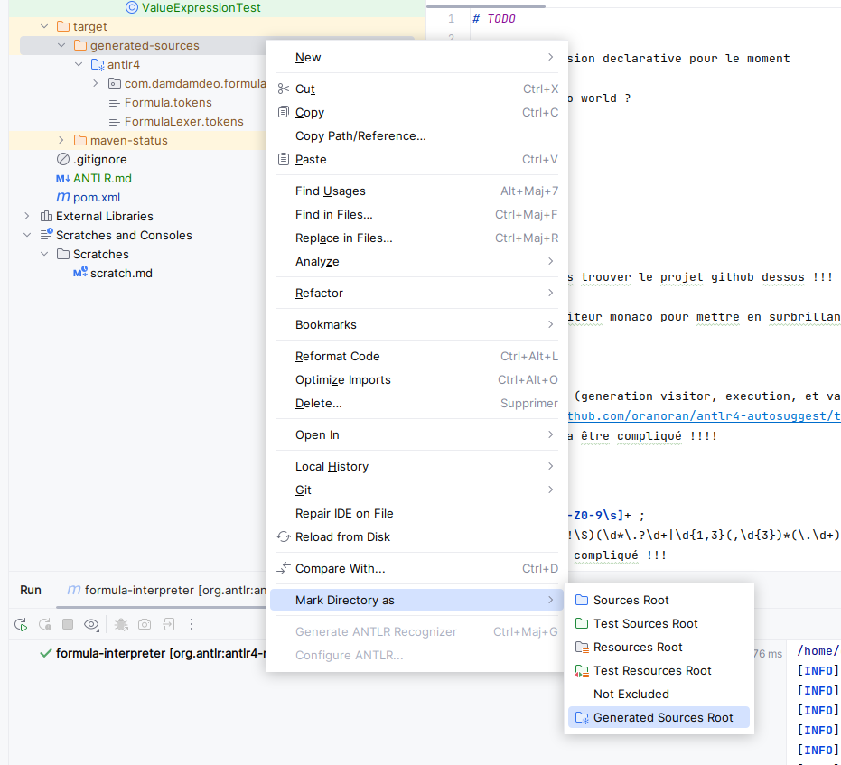

# ANTLR

## Setup IntelliJ

Antlr is a code generator placing generated code into **target/generated-sources**. You must set up IntelliJ to recognize this folder as sources to use.

## Tips

### Tests

Each time the grammar is changed the antlr goal must be re-executed before running the tests !

### Token

**Token** = TOKEN_REF, RULE_REF, LEXER_CHAR_SET, STRING_LITERAL, BEGIN_ACTION, OPTIONS, LPAREN, RPAREN, OR, DOT, NOT
